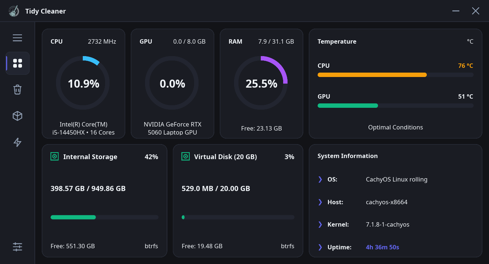

<div align="center">


# Tidy Cleaner

**Современный, ультрабыстрый и премиальный системный менеджер и инструмент очистки для Linux, написанный на Rust с использованием Slint.**

[](https://www.rust-lang.org/)
[](https://slint.dev/)
[](https://kernel.org)
[](LICENSE)
[](#локализация)

[English Version (README.md)](README.md)

</div>

---

## 🌟 Описание

**Tidy Cleaner** — это современная, легковесная и безопасная альтернатива системным клинерам для Linux. Приложение объединяет аппаратный мониторинг в реальном времени, управление дисками и продуманную систему очистки в стильном безрамочном (frameless) интерфейсе без ущерба для безопасности операционной системы.

<div align="center">



</div>

---

## ✨ Ключевые особенности

- ⚡ **Телеметрия в реальном времени** — Круговые диаграммы загрузки CPU, GPU (NVIDIA, AMD и встроенная графика Intel) и RAM с актуальной частотой и числом ядер.
- 🌡️ **Мониторинг температуры** — Живые шкалы температур CPU и GPU с адаптивной цветовой индикацией (и честным «N/A» при отсутствии датчиков).
- 💾 **Анализ накопителей** — Отдельные карточки дисков с занятым/свободным местом, файловой системой (Btrfs, ext4 и др.) и прогресс-баром.
- 💻 **Сводка о системе** — Компактная консольная карточка с информацией об ОС, хосте, ядре Linux и аптайме.
- 🧹 **Безопасная очистка** — Сканирование кэша, временных файлов и кэшей браузеров/сборок/пакетов с уровнями риска (Safe, Warning, Dangerous) и обязательным просмотром перед удалением. «Выбрать все» выделяет только безопасные элементы.
- 📦 **Менеджер приложений** — Единое управление пакетами Pacman, AUR, Flatpak, Snap, APT (dpkg) и RPM (dnf/zypper): **удаление программ**, запуск и **создание ярлыков на рабочем столе**.
- 🚀 **Управление автозагрузкой** — Просмотр, включение, выключение, удаление и **добавление программ в автозапуск** по стандарту Freedesktop (работает в любом окружении рабочего стола).
- ⚙️ **Настройки** — Тёмная / светлая / системная тема, английский / русский язык, запуск при старте системы и запуск свёрнутым.
- 🎨 **Премиальный UI без рамок** — Кастомный перемещаемый тайтлбар, ультраплавная анимация бокового меню, изменяемый размер окна и адаптивные тёмная/светлая темы.
- 🌍 **Полноценная локализация** — Внешняя XML-система локализации с полной поддержкой английского и русского языков без хардкода строк.

---

## 🛠️ Стек технологий

- **Язык разработки:** [Rust](https://www.rust-lang.org/) (Строгая безопасность памяти, асинхронный рантайм Tokio)
- **Графический фреймворк:** [Slint](https://slint.dev/) (Декларативный UI, плавные анимации, нативный рендеринг под Linux)
- **Сбор телеметрии:** `sysinfo`, интеграция с `nvidia-smi`
- **Архитектура:** Модульная архитектура без монолитных файлов, четкое разделение UI, состояний и системных сервисов

---

## 📦 Установка

### Arch Linux / CachyOS / Manjaro (AUR)

Быстрая установка готового бинарного пакета (мгновенно, без компиляции):
```bash
yay -S tidy-cleaner-bin
# или через paru
paru -S tidy-cleaner-bin
```

Либо сборка актуальной версии из исходного кода:
```bash
yay -S tidy-cleaner-git
# или через paru
paru -S tidy-cleaner-git
```

---

## 🚀 Сборка из исходного кода

### Требования

Убедитесь, что у вас установлены компилятор Rust и Cargo:

```bash
# Arch Linux / CachyOS / Manjaro
sudo pacman -S rust cargo

# Debian / Ubuntu
sudo apt update && sudo apt install cargo
```

### Запуск в режиме разработки

```bash
cargo run
```

### Сборка оптимизированного релизного бинарника

```bash
cargo build --release
```

Готовый исполняемый файл будет находиться по пути: `target/release/tidy-cleaner`.

---

## 🧪 Запуск тестов

Проверка unit-тестов, интеграционных тестов и целостности файлов локализации:

```bash
cargo test
```

---

## ❤️ Сделано с помощью ИИ

> Программа делается с помощью **Gemini 3.7 Flash** и **DeepSeek v4 Pro** ❤️

---

## 📄 Лицензия

Проект распространяется под лицензией **MIT License**. Подробнее см. файл `LICENSE`.
